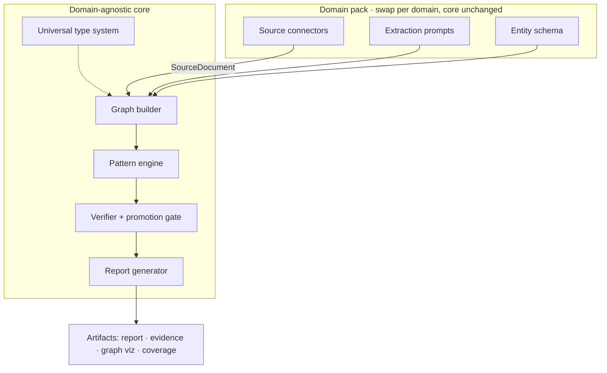
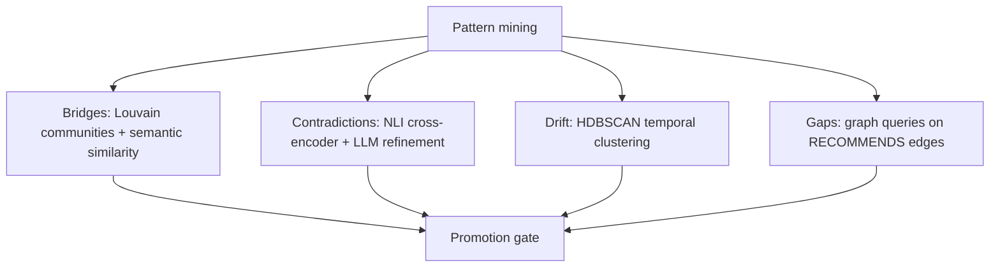

# Pattern Discovery Agent

A domain-agnostic, graph-first pattern discovery engine. Given a topic, it ingests sources from multiple APIs, builds a typed knowledge graph with provenance on every edge, runs algorithmic pattern detection, and outputs evidence-backed findings — not summaries.

Patterns are detected by algorithms (Louvain community detection, NLI cross-encoders, HDBSCAN temporal clustering, graph queries), not generated by an LLM. The LLM does two things: structured extraction (turning abstracts into typed nodes and edges) and synthesis (turning verified patterns into readable interpretations). It never gets to "discover" patterns without evidence underneath.

Built with Python, NetworkX, sentence-transformers, NLI cross-encoders, and Anthropic Claude.  
First domain pack: Research/Technical (OpenAlex, Semantic Scholar, arXiv, GitHub, Tavily).  
Runs on [RunForge](https://runforge.sh) — deploy agents, not infrastructure.

---

## Example output: Bitcoin Layer-2 scaling

Run on "Bitcoin scaling debate layer 2 solutions Lightning Network" with 122 documents from 5 source APIs, producing a 1,172-node knowledge graph:

**56 patterns promoted** across four types — 10 bridges, 41 contradictions, 5 drift transitions.

### Contradiction: Bitcoin transaction throughput

Sources disagree on Bitcoin's base-layer throughput. The engine found assertions citing 3–7, 6–8, 7, and ~13 transactions per second across different papers and articles, flagged the pairs via NLI cross-encoder, then built corroborating evidence chains from additional sources on each side.

> **Interpretation (engine-generated):** The apparent contradiction between these figures dissolves once one recognizes that both sources are describing the same underlying constraint using slightly different measurement windows. The 3–7 TPS range reflects the theoretical variability introduced by Bitcoin's block size limit combined with the ~10-minute block interval. The ~13 TPS figure likely captures observed throughput under conditions where SegWit adoption increases effective block capacity by discounting witness data. A researcher surveying this literature must treat any unqualified TPS claim as incomplete without knowing whether the source controls for SegWit utilization rates, average transaction byte size, and measurement window.

This matters because inflated or deflated baseline figures propagate into Layer 2 scaling arguments and can make second-layer solutions appear either more or less necessary than the data warrant.

### Contradiction: Lightning Network decentralization

One Tier-2 scholarly source describes the Lightning Network as exhibiting "a commendable level of decentralization." Another Tier-2 source reports that "centrality has surged over the past two years." The engine classified this as conditional — both can be true depending on when and how you measure.

> **Interpretation:** The apparent contradiction likely resolves into a measurement and temporal distinction: one assessment captures the network's structural design intent or a cross-sectional snapshot, while the other tracks dynamic graph-theoretic metrics as the network has grown and liquidity has consolidated around well-connected nodes.

### Bridge: Plasma ↔ Layer 2 scaling

The Plasma research community (primarily Ethereum-focused) and the broader Layer 2 scaling community (Bitcoin, Stacks, general) developed overlapping architectures — off-chain execution with on-chain settlement, fraud proofs, state commitments — largely in isolation. The engine detected the structural gap via Louvain community detection (cosine similarity 0.60, betweenness centrality 0.019).

> **Interpretation:** This matters because the evidence base is contradictory on its face: some sources treat Bitcoin scaling as a solved problem through L2 mechanisms while others insist no technically proven implementation exists at scale, a tension that almost certainly reflects communities using incompatible definitions and measuring success against different threat models.

### Temporal drift: 2020–2022

The field had no discernible thematic clustering through 2017. Two clusters emerged in 2018 (the initial Bitcoin scaling debate), collapsed in 2019, re-stabilized in 2020, grew to three clusters in 2021 driven by CBDC research, then consolidated back to two by 2022. The evidence shows the shift from "can distributed ledger technologies work?" to "how should sovereign institutions absorb or replicate them?"

### Run statistics

| Metric | Value |
|--------|-------|
| Documents analyzed | 122 (34 scholarly, 33 code, 33 web) |
| Source APIs | OpenAlex, Semantic Scholar, arXiv, GitHub, Tavily |
| Graph | 1,172 nodes, 1,830 edges, 15 connected components |
| Node types | 603 assertions, 233 concepts, 111 source documents, 94 artifacts, 74 actors, 57 metrics |
| Patterns promoted | 56 (41 contradictions, 10 bridges, 5 drift) |
| Wall time | ~30 minutes |
| LLM cost | ~$0.10 (Haiku extraction + Sonnet synthesis) |

---

## Architecture

### Why graph-first

Most "deep research" tools follow the same loop: search, read, summarize. The output rests on whatever the LLM felt like saying. There's no structure, no verification, no way to know if the "insight" is grounded in evidence or hallucinated.

This engine inverts that:

```
topic → classify domain → route sources → ingest → extract → build graph → detect patterns → verify → report
```

The verification pipeline is mandatory. A candidate pattern must pass a promotion gate — evidence count, source diversity, confidence threshold, category integrity — before it appears in the output. If the evidence is too thin, the system says so. If two sources contradict, it shows both sides instead of picking one.

### System layers



The core engine is domain-agnostic. It sees a graph with typed nodes and edges and runs the same algorithms regardless of domain. What changes per domain is a **domain pack** — source connectors, extraction prompts, entity schemas. Adding a new domain (sports, politics, markets) requires zero changes to the core.

### Pipeline


Each step is a RunForge `safe_step` — if a run crashes, it resumes from the last checkpoint.



### Pattern detectors

**Bridges** — Louvain community detection → inter-community edges → semantic similarity filter (0.4–0.8 band, below 0.4 is unrelated, above 0.8 is obvious) → betweenness centrality ranking → hub cap (max 2 appearances per concept) → near-duplicate pair dedup → evidence by name mention + embedding relevance.

**Contradictions** — collect Assertion nodes → pair by cosine similarity > 0.4 → NLI cross-encoder (`nli-deberta-v3-base`, softmax-normalized to probabilities) → contradiction confidence > 0.7 → LLM second pass classifies real/conditional/apparent → corroborating evidence chains from graph neighbors.

**Drift** — bin nodes by publication year → embed per window with sentence-transformers → HDBSCAN cluster per window (min_cluster_size=3, cosine distance, float64) → track cluster birth/growth/death/consolidation → collect representative assertions from each cluster.

**Gaps** — find Concept/Artifact nodes with many incoming RECOMMENDS edges but few EVALUATES/PRODUCES edges → require recommendations from ≥2 distinct source documents → filter to multi-word concept names (no umbrella terms).

### Promotion gate

Every candidate must pass pattern-type-specific checks:

| Pattern type | Evidence requirement | Additional checks |
|-------------|---------------------|-------------------|
| Bridge | ≥3 evidence items | Source diversity ≥2 tiers or ≥3 URLs |
| Contradiction | ≥1 evidence + ≥1 counter-evidence from different URLs | NLI confidence ≥0.7 after softmax |
| Drift | ≥2 evidence items from different time windows | — |
| Gap | ≥2 evidence from different source documents | Concept/Artifact only, ≥2 word name |

Confidence model: **High** (≥5 evidence, ≥2 tiers including Tier 1, no contradictions), **Medium** (meets requirements with limitations), **Low** (minimum threshold), **Unresolved** (strong evidence on both sides — system refuses to pick a winner).

### Source tiers

| Tier | Rule | Research examples |
|------|------|-------------------|
| 1 Primary | Can anchor a pattern | Peer-reviewed journals, conference proceedings |
| 2 Strong secondary | Can support, not anchor alone | arXiv preprints, credible analysis |
| 3 Weak secondary | Discovery only, cannot promote alone | Vendor blogs, general articles |
| 4 Social | Signal layer only | Forums, social media |

No pattern promotes if it rests mainly on Tier 3–4 evidence.

### Technical decisions

| Decision | Choice | Why |
|----------|--------|-----|
| Graph storage | NetworkX in-memory | Graphs are 500–5K nodes. No external DB needed in containerized agent. |
| Community detection | Louvain | Built into NetworkX. Near-identical to Leiden under 10K nodes. |
| Contradiction detection | NLI cross-encoder | Cosine similarity can't distinguish "scales to 100B" from "fails beyond 10B." Cross-encoder: 5ms per pair. |
| Embeddings | all-MiniLM-L6-v2 | Local, zero API cost. SPECTER2 from Semantic Scholar used when available. |
| Temporal clustering | HDBSCAN | No cluster count needed upfront. Identifies noise points (emerging topics). |
| Extraction | Haiku batch → Sonnet synthesis | Extraction is 100+ abstracts needing JSON. Haiku at 1/10th Sonnet cost. Synthesis is 5–10 calls needing reasoning. |

---

## Repository layout

```
pattern-discovery-agent/
├── agent.py                    # RunForge entry point (372 lines, 9 safe_steps)
├── agent.yaml
├── requirements.txt
├── scripts/
│   └── run_evaluation.py       # Standalone eval: runs pipeline, saves all intermediates
├── src/
│   ├── core/
│   │   ├── types.py            # 7 node types, 12 edge types, EdgeMeta, PatternCandidate
│   │   ├── graph.py            # KnowledgeGraph: entity resolution, serialization
│   │   ├── patterns/
│   │   │   ├── bridges.py      # Louvain + semantic similarity + hub cap + dedup
│   │   │   ├── contradictions.py  # NLI cross-encoder + LLM refinement + corroboration
│   │   │   ├── drift.py        # HDBSCAN temporal clustering
│   │   │   └── gaps.py         # Graph queries for unrealized recommendations
│   │   ├── verifier.py         # Pattern-type-specific promotion gate
│   │   └── report.py           # Markdown, evidence JSON, D3.js graph HTML
│   ├── domain_pack.py          # DomainPack base class
│   ├── packs/research/         # Connectors, schema, router, interpretation
│   └── shared/                 # Corpus, embeddings, extraction
├── tests/                      # 135+ tests (unit, integration, quality)
└── fixtures/                   # Sample API responses for offline tests
```

## Requirements

Python 3.11+. Sentence-transformers pulls in PyTorch. See `pyproject.toml` for the full dependency set.

```bash
cd pattern-discovery-agent
python3.11 -m venv .venv
source .venv/bin/activate
pip install -e ".[dev]"
```

## Environment variables

| Variable | Required | Purpose |
|----------|----------|---------|
| `ANTHROPIC_API_KEY` | Yes | Haiku extraction + Sonnet synthesis |
| `OPENALEX_API_KEY` | No | OpenAlex higher rate limits |
| `SEMANTIC_SCHOLAR_API_KEY` | No | Semantic Scholar dedicated rate limit |
| `TAVILY_API_KEY` | No | Web search connector |
| `GITHUB_TOKEN` | No | GitHub search (60→5000 req/hr) |

Copy `.env.example` to `.env` and fill in your keys.

## Running

### As a RunForge agent

```bash
python -m agent_runtime dev agent:run
```

Payload:

```json
{
  "topic": "Bitcoin scaling debate layer 2 solutions Lightning Network",
  "depth": "standard",
  "focus": "all",
  "time_range": "2020-2026",
  "max_documents": 100
}
```

### Standalone evaluation

```bash
python scripts/run_evaluation.py \
  --topic "Bitcoin scaling debate layer 2 solutions Lightning Network" \
  --depth standard \
  --max-documents 100 \
  --time-range "2020-2026" \
  --focus all
```

Saves all intermediates to `eval_output/<timestamp>/`: corpus, extraction results, graph JSON, raw candidates, pattern report, evidence table, D3.js visualization.

### Tests

```bash
# Fast suite (135+ tests, ~60s)
pytest tests/ -m "not slow and not live and not quality" -q

# Quality tests (requires a prior eval run)
pytest tests/quality/ -m quality -v
```

## What it excludes and why

| Package | Why |
|---------|-----|
| langchain, llamaindex | RAG orchestration this engine doesn't use |
| neo4j, arangodb | External DB unnecessary at 500–5K node scale |
| openai | Uses Anthropic |
| bertopic | Overkill — HDBSCAN clusters, LLM labels them |
| spacy, nltk | LLM extraction is more flexible for structured output |

## License

MIT. See [LICENSE](LICENSE).