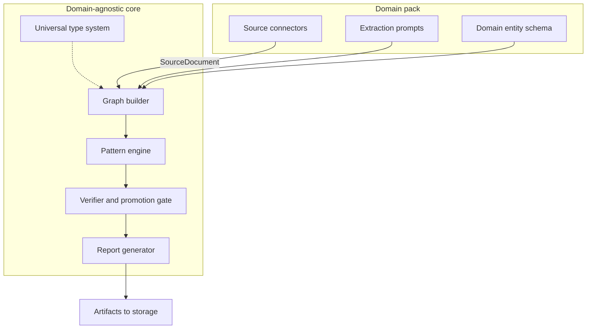
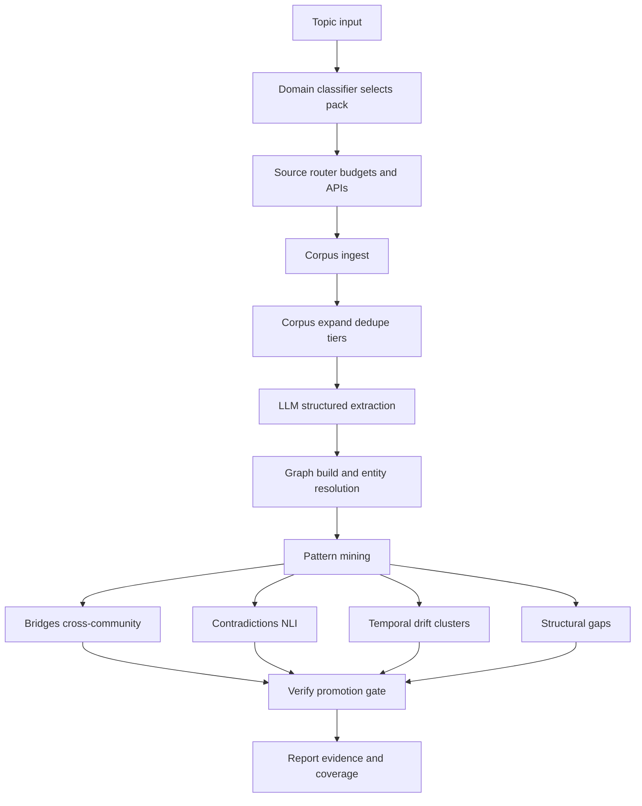

# Pattern Discovery Agent

A domain-agnostic, graph-oriented pattern discovery engine for [RunForge](https://runforge.sh). It ingests sources, builds a typed knowledge graph with provenance, runs detectors (bridges, contradictions, temporal drift, gaps), and produces evidence-backed artifacts rather than generic summaries.

The **research** domain pack covers scholarly and technical sources (OpenAlex, Semantic Scholar, arXiv, optional GitHub and Tavily). The **core type system and pipeline** stay domain-neutral so you can add packs without rewriting graph construction, verification, or reporting.

## Architecture

The engine is **graph-first**: pattern candidates come from algorithms (community structure, NLI, temporal clustering, graph queries), not from free-form LLM “insights.” The LLM **extracts** raw text into typed nodes and edges, and helps **narrate** verified results. Every promoted finding must pass a **verification gate** (evidence count, source diversity, tier rules, confidence).

A **domain pack** supplies connectors, extraction prompts, and domain entity hints. The **core** only sees universal node and edge types, provenance metadata, and the same miners and verifier regardless of domain.

### System layers



### End-to-end pipeline



## What it includes

- **Types** (`src/core/types.py`): nodes, edges, provenance metadata, documents, extraction and pattern artifacts
- **Domain packs** (`src/domain_pack.py`, `src/packs/research/`): schema, routing, and pack-specific extraction prompts
- **Connectors**: OpenAlex, Semantic Scholar, arXiv, GitHub (token), Tavily (API key); sample responses under `fixtures/` for tests
- **Corpus and NLP** (`src/shared/`): deduplication and tiering, sentence embeddings, batched LLM extraction into graph-shaped nodes and edges
- **Graph** (`src/core/graph.py`): `KnowledgeGraph` with entity resolution, multi-edge storage, JSON serialization, statistics
- **Pattern mining** (`src/core/patterns/`): bridge detection, contradiction scoring (NLI), temporal drift (clustering over time), structural gaps
- **Verification** (`src/core/verifier.py`): promotion rules and batch verification
- **Reporting** (`src/core/report.py`): markdown summaries, evidence JSON, optional D3-style graph HTML
- **RunForge entrypoint** (`agent.py`): ingest → expand → extract (skipped if no LLM key) → graph → embeddings → mine → verify → writes to `ctx.storage`; merges trigger `input` with `ctx.inputs`

## Repository layout

```
pattern-discovery/
├── agent.py                 # RunForge entrypoint
├── agent.yaml               # Agent manifest
├── pyproject.toml
├── requirements.txt
├── docs/
├── fixtures/                # Sample API responses for tests
├── src/
│   ├── core/                # types, graph, patterns/, verifier, report
│   ├── domain_pack.py
│   ├── packs/research/
│   └── shared/              # corpus, embeddings, extraction
└── tests/
```

## Requirements

- Python **3.11+**
- [agent-runtime](https://pypi.org/project/agent-runtime/) (`>=0.0.1` on PyPI). For unpublished APIs, install a local checkout:

  ```bash
  pip install -e ../agent-runtime
  ```

Sentence-transformers pulls in PyTorch; see `pyproject.toml` for the full dependency set.

## Environment variables

| Variable | Required | Role |
|----------|----------|------|
| `ANTHROPIC_API_KEY` | For LLM extraction | Claude (extraction step) |
| `OPENALEX_API_KEY` | No | OpenAlex authenticated usage |
| `SEMANTIC_SCHOLAR_API_KEY` | No | Higher Semantic Scholar rate limits |
| `GITHUB_TOKEN` | No | GitHub search quota |
| `TAVILY_API_KEY` | No | Web search connector |

## Local development

```bash
cd pattern-discovery
python3.11 -m venv .venv
source .venv/bin/activate   # Windows: .venv\Scripts\activate
pip install -e ".[dev]"
```

Run the default test selection (excludes `slow`):

```bash
PYTHONPATH=. pytest tests/ -m "not slow" -q
```

Pytest markers: `slow` (model download or heavy compute), `live` (real HTTP, when used), `integration` (light smoke). Stricter example: `-m "not slow and not live and not integration"`.

## Running the agent locally

```bash
python -m agent_runtime dev agent:run
```

Match `agent.yaml` `entrypoint` to your module (`agent:run`). Inputs from the trigger payload and `ctx.inputs` are merged. Example payload:

```json
{
  "topic": "AI agent frameworks and orchestration",
  "depth": "standard",
  "focus": "all",
  "time_range": "2023-2026",
  "max_documents": 100,
  "resume": false
}
```

Set `"resume": true` when `ctx.storage` already has `documents.json`, `extraction_results.json`, and `graph.json` from a previous run (same project storage). In that case ingest, expansion, extraction, and graph rebuild are skipped; embeddings are filled in if missing, then mining, verification, and reporting run again.

## License

MIT. Add a `LICENSE` file when you publish.

## Contributing

Changes that touch behavior should include or update tests under `tests/`.
